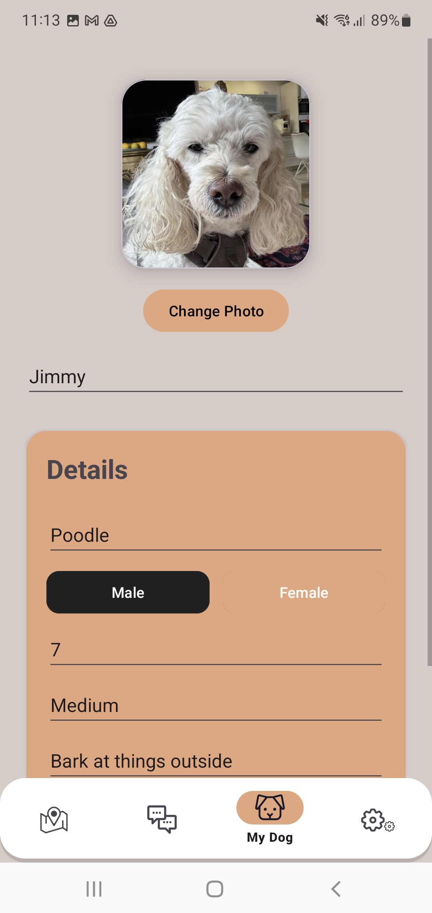
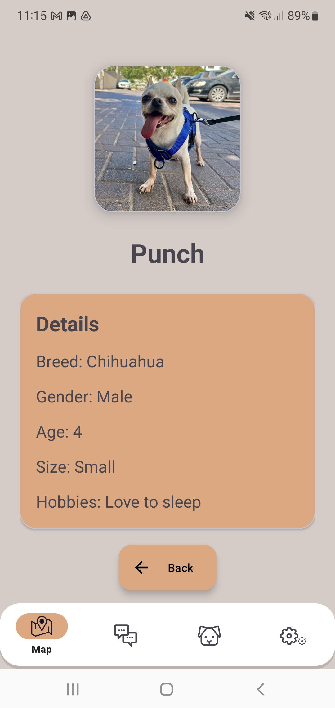
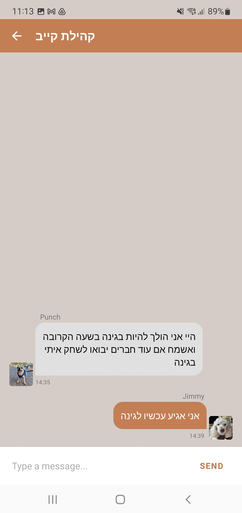
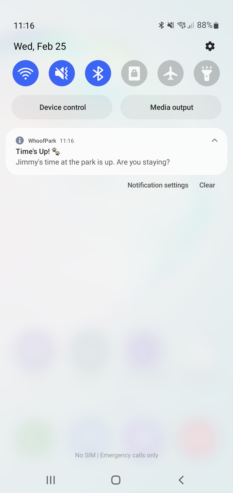
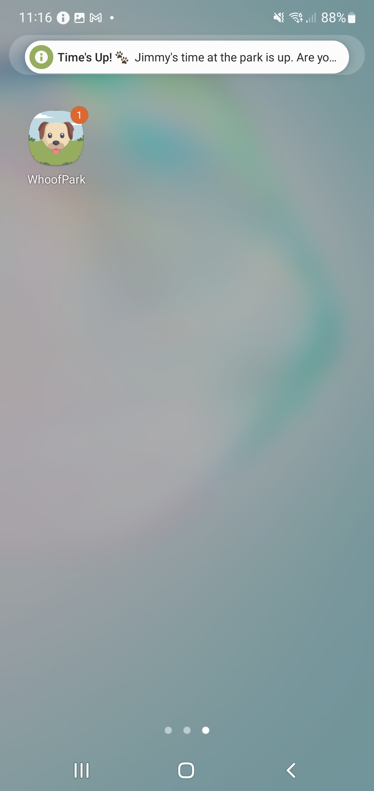
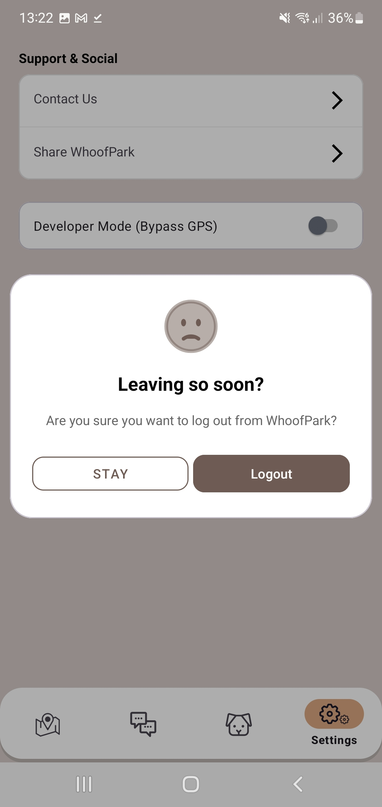

  

<h1 align="center">🐾 WhoofPark</h1>

<b>Know who's barking before you go.</b>

WhoofPark is a real time dog park presence app that enables owners to view live park activity, see which dogs are present, discover potential playmates, coordinate visits, and interact with other dog owners instantly.

---

## 🎥 Demo & Presentation

  

  

---

# 🚀 The Problem: “The Empty Park Gamble”

Dog owners frequently encounter a familiar frustration:

You return home after a long, exhausting workday with an energetic dog eager to play.

You head to the local dog park, hoping to find other dogs.

You arrive… only to discover a completely empty park.

This results in:

- **Wasted Time**: Traveling without knowing if other dogs are present  
- **Unpredictable Experience**: No visibility into park activity  
- **Manual Effort**: Owners becoming the “playmate” instead of enabling social play  
- **Lack of Coordination**: No easy way to connect with other owners  

**There is currently no reliable way to know what’s happening at the park until physically arriving.**

---

# ✨ The Solution: WhoofPark

WhoofPark provides real time visibility into dog park activity, allowing owners to see which dogs are present, manage their presence, and communicate with other owners at the park.

---

## 📍 Live Presence Map

- Displays dog parks across Tel Aviv  
- Shows user location in real time  
- Visualizes active park occupancy  

Park locations and metadata are retrieved dynamically from the **Tel Aviv Municipality Open Data API** via HTTP requests.

Any updates in municipal data are automatically reflected in the app.

---

## 🐶 Digital Dog Profiles

Each user maintains a customizable dog profile:

- Dog name 
- Profile photo 
- Breed  
- Age
- Hobbies

 
Users can:

- Upload images from gallery  
- Capture photos directly via camera  
- Crop images using integrated image-processing tools  

Profile data and images are stored securely in **Firebase Firestore & Firebase Storage**.

---

## 🏞 Dog Park Screen

Each park includes a detailed information view:

- Park name  
- Park image  
- Address  
- Operating hours  
- List of dogs currently present  

**Data sources:**

- Park metadata → Municipal API (JSON → Kotlin Objects)  
- Presence & images → Firebase Firestore / Storage  

Users can tap any dog to view its full profile.

---

## 💬 Dedicated Park Chat

Every dog park contains its own real time chat room:

- Enables communication between owners  
- Supports coordination & social interaction  

When a user sends a message for the first time:

✅ The conversation is automatically saved in the **Chats Fragment**.

---

## 🗂 Chats Fragment

- Stores conversations the user participated in  
- Allows quick navigation back to park chats  

---

## ⏱ Smart Presence System

WhoofPark implements a reliability focused presence engine.

### ✅ Presence Validation

To ensure data integrity:

- Users can declare presence only within **100 meters** of a park  
- Uses **Google Play Services Location API**

---

### 🧪 Demo Mode

For presentation & testing purposes:

- Skips location validation  
- Allows simulated park check-ins  

⚠️ Clearly defined as demonstration only logic.

---

## ⌛ Presence Timer & Background Reliability

Users specify their estimated stay duration.

A background processing mechanism:

- Tracks remaining time  
- Maintains presence state  
- Operates even if the app is closed  

**Powered by:**

✅ **WorkManager**

Responsibilities:

- Presence timeout logic  
- Automatic check out  
- Notification delivery  

---

## 🔔 Notification & Dialog Flow

When stay duration expires:

1️⃣ User receives a **Notification**

2️⃣ Upon returning to the app → A **Dialog** appears:

- Stay time expired  
- Extend stay  
- Leave park  

### Extend Stay Flow

If the user chooses to extend:

- App navigates directly to the relevant park  
- Displays time-input dialog immediately  

---

## 🧠 Intelligent UX Behavior

To avoid intrusive experiences:

✅ If the user ignores the notification and does not reopen the app →  
The expiration dialog **will NOT appear on next launch**.

---

# ⚙️ Additional Screens

## ✨ Splash Screen

- Animated launch screen  
- Consistent animation language with Login  

---

## 🔐 Login Screen

Integrated with Firebase Authentication:

- Email & Password  
- Google Sign In  
- Phone / SMS  

---

## ⚙️ Settings Screen

- Contact via email  
- Share application  
- Logout  

---

## 🚪 Logout Safety Mechanism

Logout requires explicit confirmation:

✅ Prevents accidental disconnections

---

# 🛠️ Technology Stack

## **Core Technologies**

- **Language:** Kotlin  
- **UI:** Material Design 3 (M3)  
- **Architecture:** MVVM  
- **View System:** View Binding  

---

## **Firebase Ecosystem**

### **Cloud Firestore**

Real-time NoSQL database for:

- Dog profiles  
- Presence system  
- Chat system  

---

### **Firebase Authentication UI**

Secure multi-provider authentication.

---

### **Firebase Storage**

Cloud storage for:

- Dog profile images  
- Dog park images  

---

## **Android Jetpack**

- **Navigation Component**: Fragment transitions & back-stack  
- **Lifecycle (ViewModel & LiveData)**: Reactive UI & state persistence  
- **WorkManager**: Reliable background processing  

---

## **Maps & Location**

- **Google Maps SDK**: Interactive park visualization  
- **Google Play Services Location**: Real-time proximity detection  

---

## **Networking & Data**

- **OkHttp3**: HTTP communication with municipal APIs  
- **GSON**: JSON → Kotlin object parsing  

---

## **UI / UX Libraries**

- **Lottie**: Vector animations  
- **Glide**: Image loading & caching  
- **Android Image Cropper**: Image processing  

---

# 🎯 Engineering Focus

WhoofPark was designed to explore and demonstrate:

- Real time mobile synchronization  
- Reliable presence systems  
- Background task resilience  
- API integration patterns  
- MVVM architecture best practices  
- UX driven state management  

---

# 📸 Screenshots

## 🚀 App Flow

  
  

  Splash Screen • Authentication

---

## 📍 Live Map & Presence

  
  

  Live Location • Park Presence

---

## 🐶 Dog Profiles

  
  
  

  My Dog Profile • Edit My Dog Profile • Other Dog Profile

---

## 🏞 Dog Park Experience

  
  

  Park Details • Check-In

---

## 💬 Real-Time Chat

  
  

  Park Chat • Conversations

---

## 🔔 Notifications & Presence Logic

  
  
  

  Notification • Alert • Stay Expired

---

## ⚙️ Settings & System Dialogs

  
  

  Settings • Logout Confirmation

 

---

# 🚧 Future Enhancements

- Push notifications for park activity  
- Dog compatibility filters  
- Friend & recurring playmate system  
- Smart recommendations  

---

## 👤 Author

**Itamar Hadad**  

📧 Email: hzitamar4@gmail.com  
🔗 LinkedIn: [https://www.linkedin.com/in/itamar-hadad](https://www.linkedin.com/in/itamar-hadad-1aa946307/)
